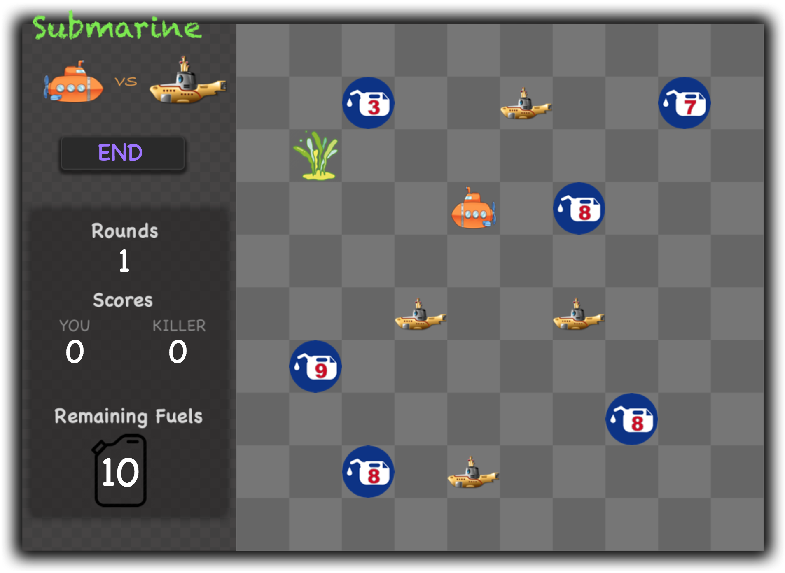

## Introduction
The JavaScript program implements a simple game named *submarine* which consists of three stages, setup, play and end as the snapshots show:

## Details
During the play stage the game proceeds in rounds. The game is played on a grid with 10 x 10 cells. It involves a submarine that is controlled by the user and a couple of robotic killer submarines that are controlled by the computer (that is, your program). The user and the computer are the two players of the game. The user's submarine only has a limited amount of fuel and needs to collect fuel cells to keep going. The robotic killer submarines hunt the user's submarine; the user's submarine tries to avoid getting caught while also collecting all the fuel cells on the grid.

### Setup stage

The game always starts in the setup stage. During that stage the user is shown the grid and can place three different types of objects on the cells of the grid:

* by clicking on a cell and typing a number between 1 and 9, a fuel cell is placed on a grid cell, the number indicates the amount of fuel in the fuel cell;
* by clicking on a cell and typing the letter "o", an obstacle is placed on a cell;
* by clicking on a cell and typing the letter "u", the user's submarine is placed on a cell.
* by clicking on a cell and typing the letter "k", a robotic killer submarine is placed on a cell.

### Start stage

While in the play stage, the game proceeds in rounds, each round starting with the user's turn followed by the computer's turn. The user can attempt to move his/her submarine horizontally or vertically on the grid by typing one of four letters:

* "a" attempts to move the user's submarine one grid cell to the left,
* "d" attempts to move the user's submarine one grid cell to the right,
* "w" attempts to move the user's submarine one grid cell up,
* "x" attempts to move the user's submarine one grid cell down.

### End stage
The play stage ends if one of the following conditions becomes true:

* the user ends the play stage (by pressing the button provided for that);
* the user's submarine is destroyed;
* there are no fuel cells left on the grid;
* neither the user's submarine nor any of the robotic 

The game outcome is a win for the user if there are no robotic killer submarines left on the grid or the user's score is higher than the computer's score; the outcome is a win for the computer if the user's submarine has been destroyed or the computer's score is higher than the user's score; otherwise, the outcome is a draw. 

## Others